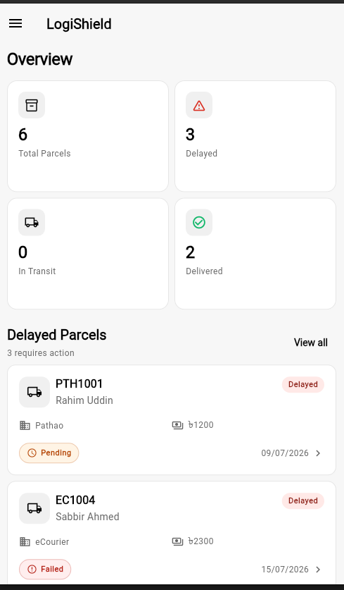
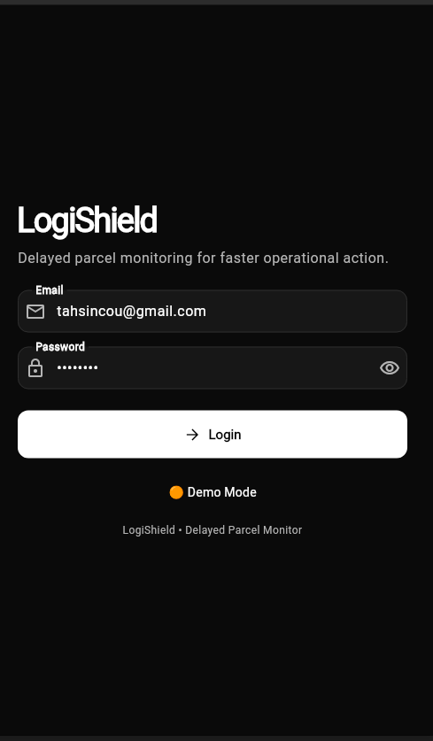
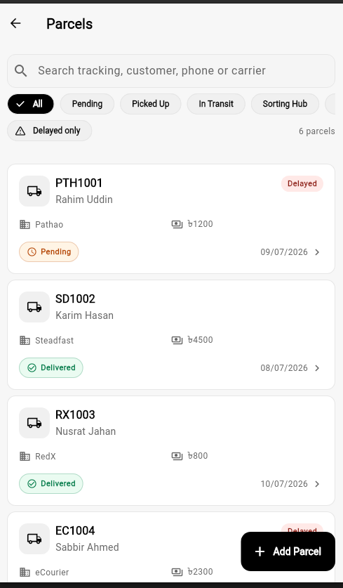
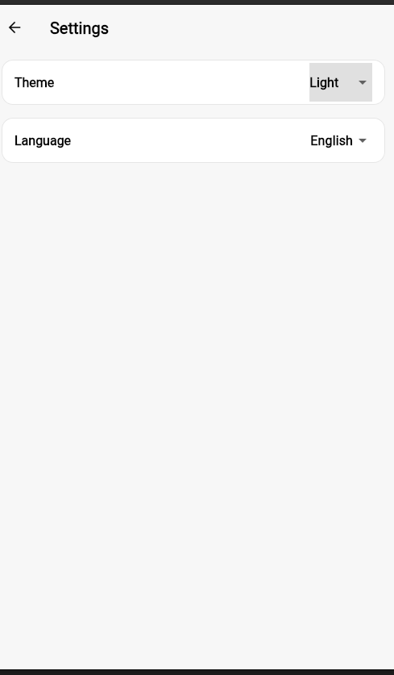
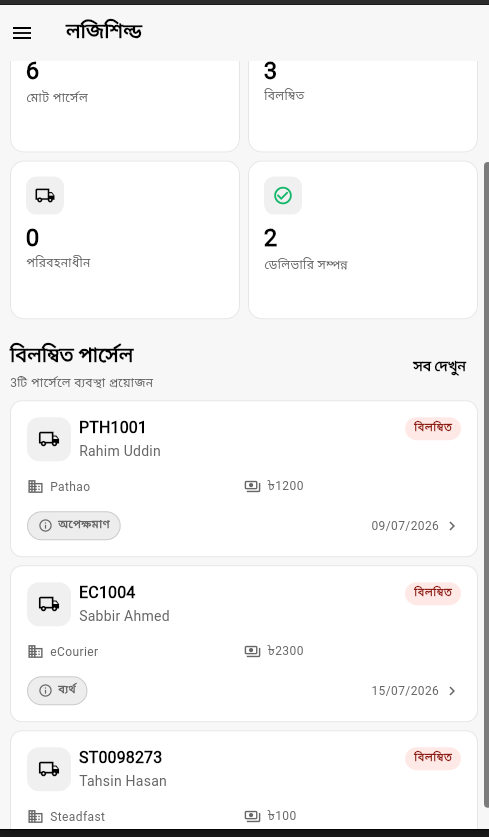

# LogiShield

**Offline-First Parcel Monitoring System built with Flutter**



LogiShield is a Flutter application for monitoring parcel deliveries, identifying delayed shipments, and managing parcel information. It is built with Clean Architecture and designed as a reusable starter template for logistics applications.

## Features

* JWT Authentication
* Environment Switching (Demo / Staging)
* Node.js Mock Server & Supabase Backend
* Offline Support (SQLite)
* Parcel CRUD
* Dashboard Analytics
* Search & Filters
* Parcel Timeline
* English & Bangla Localization
* Light & Dark Theme
* Riverpod State Management


## Screenshots

| Login | Dashboard |
|-------|-----------|
|  |  |

| Parcel List | Settings |
|-------------|----------------|
|  |  |

| Bangla |
|------------|
|  |


## Tech Stack

* Flutter & Dart
* Riverpod
* Clean Architecture
* Dio
* SQLite
* Supabase
* Node.js
* JWT Authentication

## Screenshots

* Login
* Dashboard
* Parcel List
* Parcel Details
* Create Parcel
* Settings
* Dark Theme
* Bangla Language

## Run

```bash
flutter pub get
flutter run
```

For Demo mode, start the Node.js mock server.

For Staging mode, configure your Supabase credentials in `supabase_config.dart` and select **Staging** from the login screen.

## Future Improvements

* OCR Parcel Label Scanner
* Barcode / QR Scanning
* Push Notifications
* Parcel Delay Prediction
